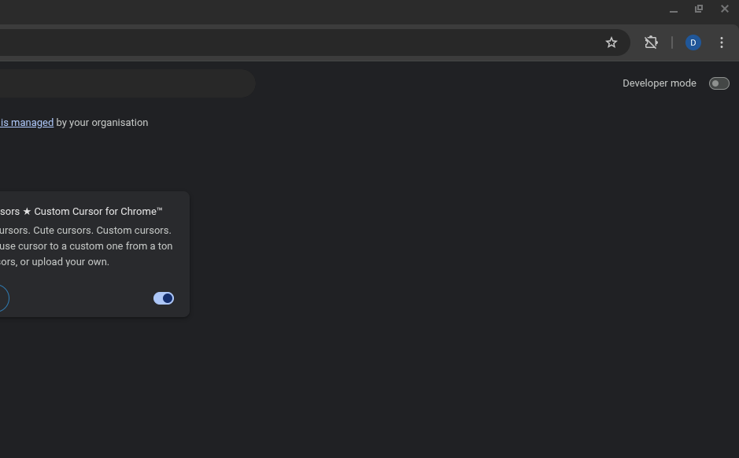
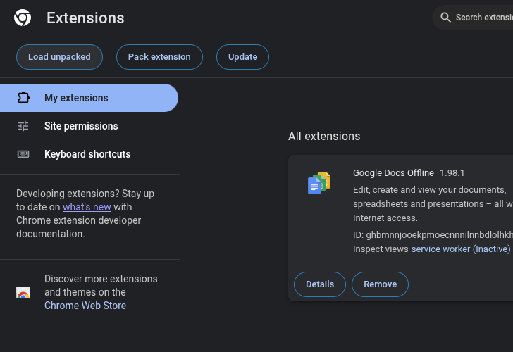

# Java-Doc-Highlight-Extension

### Step 1:
  Clone the repo
  ```sh
  git clone https://github.com/sanz-s/Java-Doc-Highlight-Extension.git
```

### Step 2:
  - Open Chrome
  - Navigate to Chrome Extensions
  - Enable Developer Mode
    
    

### Step 3:
  - Load Extension
    
    

    > locate to folder and open the _Java Doc Highlight_ Extension src folder

### > Done !

# Usage
 - Visit Any Oracle Java Docs
 - Code Blocks Will be Highlighted Automatically

# Dark & light
  
